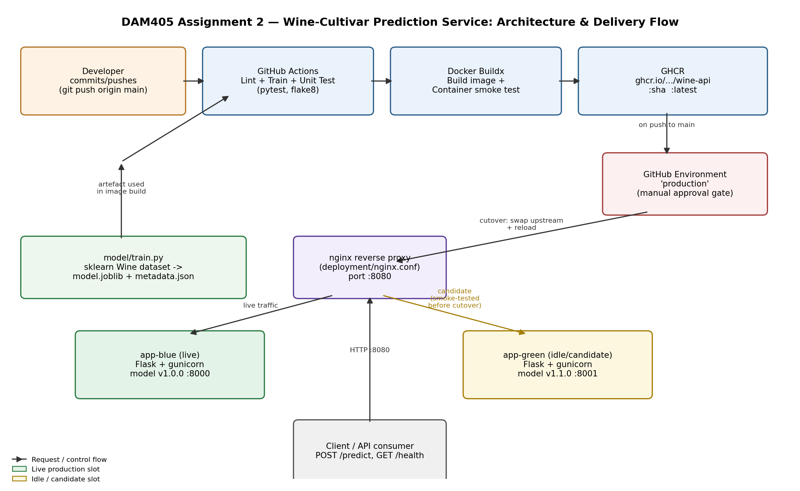
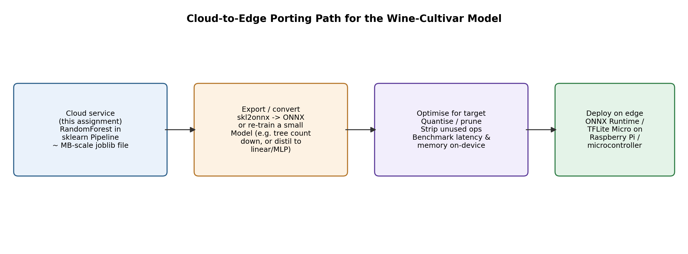

# Packaging & Delivering an ML Model as a Service

**Module:** DAM405 — Machine Learning Operations
**Assignment:** Programming Assignment 2
**Student ID:** 02230289
**Repository:** `AS2025_DAM405_02230289_PA2`
**Learning outcomes assessed:** LO4 (edge deployment use cases), LO5 (continuous delivery pipeline design)

---

## 1. Introduction

### 1.1 The problem

A trained model that exists only as a `.joblib` file on a laptop is not a product. To be
useful it has to be reachable over a network, reproducible on any machine, validated
automatically before it reaches users, and replaceable without downtime when a better
version is trained. This assignment turns a scikit-learn classifier into exactly that: a
containerised HTTP prediction service with an automated delivery pipeline that builds,
tests, publishes and rolls it out on every change.

### 1.2 The dataset and model

The service wraps the **UCI Wine recognition dataset**, accessed through
`sklearn.datasets.load_wine`. It is a 178-sample, 13-feature, 3-class problem: predict
which of three cultivars a wine came from, given physicochemical measurements
(alcohol, malic acid, magnesium, colour intensity, proline, and so on).

The dataset was chosen deliberately for **operational** reasons rather than modelling
ambition. It ships inside the scikit-learn wheel, so the training step needs no network
access, no credentials and no data-versioning infrastructure to be byte-for-byte
reproducible inside a GitHub Actions runner. Since the assessed artefact here is the
*delivery pipeline*, not the model's accuracy, a dataset that removes ingestion
flakiness from the pipeline is the right trade — and this choice is revisited honestly
in §8, because it also removes a problem that real MLOps must solve.

The model is a `RandomForestClassifier` (200 trees, `max_depth=6`) wrapped in a
scikit-learn `Pipeline` behind a `StandardScaler`. Using a `Pipeline` rather than a bare
estimator is an operational decision: preprocessing travels *inside* the serialised
artefact, so the serving code cannot drift from the training-time transformation. This
is the single most common source of training/serving skew, and the `Pipeline` design
makes it structurally impossible here.

### 1.3 Overall approach

| Layer | Choice | Artefact |
|---|---|---|
| Training | scikit-learn `Pipeline`, versioned + metadata sidecar | `model/train.py` |
| Serving | Flask API, gunicorn WSGI server | `app/main.py` |
| Packaging | Multi-stage Docker, slim base, non-root | `Dockerfile`, `.dockerignore` |
| Delivery | GitHub Actions, 4 gated stages | `.github/workflows/ci-cd.yml` |
| Infrastructure | Docker Compose (primary), Terraform (alternative) | `docker-compose.yml`, `deployment/main.tf` |
| Rollout | Blue-green via nginx upstream swap | `deployment/switch_traffic.sh`, `rollback.sh` |

A key design decision is that **the model artefact is built once and promoted, never
rebuilt per stage**. `train.py` runs in the first pipeline stage and uploads
`model.joblib` as a build artefact; every later stage downloads that exact file. The
bytes that were tested are the bytes that get shipped.

---

## 2. Architecture



*Figure 1 — End-to-end architecture. A developer push triggers GitHub Actions, which
trains, tests, builds and publishes an image to GHCR. Deployment is gated on a manual
approval environment, and cutover happens by swapping the nginx upstream between the
blue and green slots.*

The runtime topology has three moving parts:

- **`app-blue` / `app-green`** — two identical containers of the service. At any moment
  one is *live* (receiving traffic) and one is *idle* (holding the previous or the
  candidate version).
- **`proxy`** — an nginx reverse proxy on port `8080`, the only port exposed to clients.
  Its `upstream` block names exactly one slot.
- **Clients** — talk only to the proxy, and are unaware which slot serves them.

Because clients address the proxy and never a slot directly, a release is a change to
one line of nginx config, not a change to any running container.

### 2.1 API surface

| Method | Route | Purpose |
|---|---|---|
| `GET` | `/health` | Liveness/readiness. Returns `200` only if the model deserialised successfully; `503` otherwise. Consumed by the Docker `HEALTHCHECK`, Compose, and the pipeline's smoke test. |
| `GET` | `/version` | Reports the loaded `model_version`, algorithm, training timestamp and test accuracy. This is what makes a blue-green cutover *observable* — you can prove which version is live. |
| `POST` | `/predict` | Accepts one feature vector, returns the predicted class plus per-class probabilities. |

The health endpoint is deliberately **coupled to model state, not process state**. A
Flask process that is running but failed to load its model is worse than a dead one: it
accepts traffic and fails every request. By returning `503` when `_model is None`, a
broken slot can never be promoted to live — the cutover script's pre-flight check will
refuse it.

---

## 3. The delivery pipeline

The pipeline is defined in `.github/workflows/ci-cd.yml` and runs on every push and pull
request to `main`. It is four jobs in a dependency chain: **each job is a gate, and a
failure at any gate stops the release**.

```
lint-and-test ──▶ build-and-container-test ──▶ publish ──▶ deploy-blue-green
   (always)              (always)              (main only)   (manual approval)
```

### Stage 1 — `lint-and-test`

| Step | What it guarantees |
|---|---|
| `flake8 app/ model/ tests/` | Code is syntactically valid and stylistically consistent; no unused imports or dead names reach the image. |
| `python model/train.py` | **Training is reproducible from a clean checkout.** This is the step that would catch a model that only trains on the author's machine. |
| `pytest tests/test_api.py -v` | The 11 API tests pass — covering the happy path, and every validation and error branch. |
| `upload-artifact: trained-model` | Freezes `model.joblib` + `metadata.json` as the immutable candidate artefact for all later stages. |

Running training *inside* CI, rather than trusting the committed `.joblib`, is what makes
this a **machine learning** delivery pipeline rather than a generic web-app one. The
model is treated as a build output subject to the same gates as code.

### Stage 2 — `build-and-container-test`

| Step | What it guarantees |
|---|---|
| `download-artifact` | The image is built around the artefact Stage 1 produced, not a stale committed copy. |
| `docker/build-push-action` (`push: false`, `load: true`) | The `Dockerfile` builds successfully. GitHub Actions layer caching (`type=gha`) is enabled so unchanged dependencies are not reinstalled. |
| `docker run -d` | The image actually **starts** — catching entrypoint, permission and missing-file faults that a build alone cannot. |
| `python tests/smoke_test.py` | The container answers **real HTTP requests over a socket**. This is a genuinely different assertion from the pytest suite, which uses the in-process Flask test client and would pass even if gunicorn, the port binding or the non-root file permissions were broken. |
| `docker image inspect --format {{.Size}}` | Image size is recorded on every build, so bloat is visible as it happens rather than discovered in production. |
| `docker logs` (`if: always()`) | Container logs are captured even on failure, so a red build is diagnosable without reproducing it locally. |
| `docker save` → `upload-artifact` | The tested image is retained as a downloadable build artifact, satisfying the "registry **or** artifact" requirement by both routes. |

### Stage 3 — `publish`

Guarded by `if: github.event_name == 'push' && github.ref == 'refs/heads/main'`, so pull
requests are fully built and tested but **never publish**. It authenticates to the GitHub
Container Registry with the automatic `GITHUB_TOKEN` (scoped `packages: write`, no
long-lived secret to leak) and pushes two tags:

- `:${{ github.sha }}` — immutable, and the tag deployments actually reference. Every
  running container can be traced back to one exact commit.
- `:latest` — a moving convenience pointer.

Deploying by SHA rather than by `latest` is what makes rollback deterministic: the
previous release is still addressable after a new one is published.

### Stage 4 — `deploy-blue-green`

Bound to the GitHub **`production` environment**, which supplies the required-reviewer
approval gate — the pipeline is *continuous delivery*, not continuous deployment: every
change is proven releasable automatically, but a human authorises the release. The job
determines the target slot, deploys the new image into the **idle** slot, cuts traffic
over, and runs post-deployment verification.

The deploy steps invoke the real scripts (`switch_traffic.sh`, `smoke_test.py`) but are
`echo`-guarded in the committed workflow, because this repository has no persistent
deployment host to SSH into. The same sequence is demonstrated for real against local
Docker in §7.3, and the commands that would replace the echoes are retained inline in
the workflow.

---

## 4. Containerisation choices

Every instruction in the `Dockerfile` is a deliberate choice; the table below maps each
to the best practice it implements.

| Practice | Implementation | Why it matters |
|---|---|---|
| **Slim base image** | `python:3.12-slim` (not `python:3.12`, ~4× larger) | Fewer preinstalled packages means a smaller image *and* a smaller CVE surface. |
| **Multi-stage build** | `builder` stage creates `/opt/venv`; `runtime` stage copies only the finished venv | pip caches, wheels and build toolchain never reach the shipped image. |
| **Dependency-layer caching** | `COPY requirements.txt` and `pip install` occur **before** `COPY app/` | Editing application code reuses the cached dependency layer; sklearn/numpy are only reinstalled when `requirements.txt` changes. This is the difference between a ~10 s and a multi-minute CI build. |
| **Non-root user** | `groupadd`/`useradd` `appuser` (uid 1000), `chown`, then `USER appuser` | A container escape or RCE lands as an unprivileged user. `--shell /bin/false` denies an interactive shell. |
| **`.dockerignore`** | Excludes `.git`, `.venv`, `tests/`, `evidence/`, `diagrams/`, `__pycache__`, `*.md` | Shrinks the build context (faster uploads, better cache hits) and keeps the local virtualenv and history out of the image. |
| **Pinned dependencies** | Exact `==` pins in `requirements.txt` | The image built today and the image rebuilt in six months contain the same code. |
| **Production WSGI server** | `gunicorn --workers 2`, not `flask run` | The Flask development server is single-threaded and explicitly unsupported for production. |
| **Container `HEALTHCHECK`** | Polls `/health` every 15 s with a 10 s start period | The orchestrator learns the container is unhealthy without any application cooperation. |
| **Reproducibility env vars** | `PYTHONDONTWRITEBYTECODE=1`, `PYTHONUNBUFFERED=1` | No stray `.pyc` files; logs stream immediately instead of sitting in a buffer, which matters when `docker logs` is your only view during an incident. |
| **OCI labels** | `org.opencontainers.image.*` | The image is self-describing under `docker inspect`. |

Two choices deserve elaboration:

**Why copy only `model/model.joblib` and `model/metadata.json`, not `model/`?** The
training script and its heavyweight import graph are build-time concerns. The serving
image needs the artefact, not the recipe that produced it. Narrowing the `COPY` keeps
`train.py` out of the runtime attack surface.

**Why `chown` before `USER` rather than `COPY --chown`?** A single `RUN chown -R` after
all copies is one layer and one clear ownership boundary; the alternative repeats the
flag on every `COPY` and is easier to get subtly wrong when a new `COPY` is added later.

---

## 5. Rollout and rollback strategy

### 5.1 Why blue-green

A canary (routing e.g. 5% of traffic to the new version) gives a finer-grained blast
radius, but statistically meaningful canary analysis needs traffic volume and a metrics
backend to compare cohorts. For a single-model service with no live traffic to sample,
**blue-green is the honest choice**: it gives a near-instant, all-or-nothing cutover and
— crucially — an equally instant reversal. The nginx `upstream` block is the seam that
makes both directions cheap, and the same seam would support weighted canary routing
later by adding a second `server` line with a `weight=` parameter.

### 5.2 The cutover sequence

`deployment/switch_traffic.sh <blue|green>` implements four steps:

1. **Deploy to the idle slot only.** Live traffic is untouched throughout; if the new
   image will not even start, no user has seen it.
2. **Pre-flight health check against the idle slot directly**, bypassing the proxy. Since
   `/health` returns `503` when the model failed to load, a broken candidate is rejected
   *before* it can be promoted.
3. **Flip the upstream and `nginx -s reload`.** This is the cutover. A reload is graceful:
   nginx starts new worker processes with the new config and lets old workers finish
   their in-flight requests, so no connection is dropped. It is atomic from the client's
   perspective and takes well under a second.
4. **Post-cutover smoke test through the proxy**, confirming that what users now reach
   is healthy and serving correct predictions.

### 5.3 Rollback

The rollback plan rests on one rule: **the previous slot is never torn down.** It keeps
running, warm and healthy, holding the previous version.

Rollback is therefore not a redeploy. `deployment/rollback.sh <slot>` performs the same
config flip in reverse plus an nginx reload — sub-second, with no image pull, no rebuild
and no container start. There is no scenario in which recovery is blocked waiting on a
registry or a build.

| | Forward cutover | Rollback |
|---|---|---|
| Action | Swap upstream + reload | Swap upstream back + reload |
| Time | < 1 s | < 1 s |
| Requires a build/pull? | No (image pre-pulled into idle slot) | No (old container still running) |
| Requires human approval? | Yes (GitHub `production` environment) | No — it must be fast |

Because deployments reference the immutable `:${{ github.sha }}` tag, "the previous
version" is unambiguous even after several releases.

### 5.4 How I would monitor a release

Detection has to be faster than the damage, so monitoring is scoped to the cutover
window and the hour after it:

- **Golden signals from the proxy** — nginx access logs give request rate, error rate
  (`5xx` share) and latency percentiles per upstream. The single most important
  comparison is *new slot `5xx` rate vs. the old slot's baseline over the same window*.
- **`/version` as the deployment assertion** — polled continuously, it proves which
  model version is actually serving. A cutover that "succeeded" while `/version` still
  reports the old build is a silent failure that only this check catches.
- **Container health transitions** — the Docker `HEALTHCHECK` state moving to
  `unhealthy` is the earliest structural signal, ahead of user-visible errors.
- **ML-specific signals**, which generic web monitoring misses entirely:
  - *Prediction distribution drift* — if the class balance of predictions shifts sharply
    at the moment of cutover, the new model behaves differently on the same traffic.
  - *Mean predicted confidence* — a fall in average max-probability indicates the model
    is less certain, often the first sign of a bad artefact or a feature-scaling bug.
  - *Validation-error rate on `/predict`* — a spike in `400`s means clients and the
    model's expected schema have diverged.
- **Automated abort criterion.** I would define the rollback trigger *before* the
  release, not during it: if `5xx` rate exceeds 1% or p99 latency more than doubles
  against baseline within 10 minutes of cutover, `rollback.sh` runs automatically. An
  unattended rollback trigger is what converts a fast rollback mechanism into an actually
  reliable one — a human noticing a dashboard is not a control.

---

## 6. Edge-porting analysis (LO4)



*Figure 2 — Porting path from the containerised cloud service to an on-device runtime.*

### 6.1 The use case

The natural edge case for this model is **in-line quality control on a production or
bottling line**: a sensor rig takes physicochemical readings and must classify the batch
immediately. This is a genuine edge use case rather than a contrived one, because it has
the three properties that justify moving compute to the device:

1. **Latency** — a network round trip is dead time on a moving line; local inference on
   a 13-feature tree ensemble is sub-millisecond.
2. **Connectivity** — factory floors and agricultural sites have intermittent networks.
   A cloud-dependent classifier stops the line when the link drops; a local one does not.
3. **Data gravity and privacy** — raw process measurements can be commercially sensitive.
   Sending only the classification, or nothing at all, is a smaller exposure than
   streaming every reading to a third party.

### 6.2 The porting path

**Step 1 — Convert the artefact.** The current `model.joblib` is a Python pickle: it
requires a compatible Python *and* a compatible scikit-learn to deserialise, which is a
fragile dependency to carry onto a device. I would convert the `Pipeline` to **ONNX** via
`skl2onnx`. ONNX serialises the scaler and the forest together into one framework-neutral
graph, executable by ONNX Runtime in C++, Rust or Python — the Python dependency
disappears, and the `StandardScaler` stays fused to the model, preserving the
anti-skew property from §1.2.

**Step 2 — Shrink the model.** A 200-tree forest at `max_depth=6` is roughly 416 KB as
joblib — comfortable on a Raspberry Pi, but not on a microcontroller. Options, in
increasing order of aggressiveness: reduce `n_estimators` (accuracy on this dataset is
near-saturated, so many trees are redundant); quantise leaf values from float64 to int8;
or distil to a single decision tree or logistic-regression model that fits in a few KB of
flash. For a Class-1-or-2 tier device, targeting **TensorFlow Lite Micro** with a small
MLP would be the route.

**Step 3 — Match the runtime to the device class.** The right answer differs sharply by
tier, and this is the core of the trade-off:

| Target | Runtime | Feasibility |
|---|---|---|
| Raspberry Pi 4 / Jetson (Linux, ~GB RAM) | The **existing container**, rebuilt for `linux/arm64` via `docker buildx --platform` | Easiest path — the entire architecture in this report transfers essentially unchanged. |
| Pi Zero / low-power SBC | ONNX Runtime, no container, model loaded directly | Drop Docker's overhead; keep the ONNX artefact. |
| Microcontroller (Cortex-M, ~KB RAM) | TFLite Micro / hand-generated C | Requires abandoning the forest for a distilled model; no OS, no Python, no container. |

### 6.3 The trade-offs

| Dimension | Cloud service (this assignment) | Edge deployment |
|---|---|---|
| **Latency** | Network-bound, tens of ms, variable | Sub-ms, deterministic |
| **Availability** | Fails when connectivity fails | Runs offline |
| **Update mechanism** | `switch_traffic.sh`, seconds, fully controlled | OTA update to a fleet — slow, partial, and some devices will run stale models indefinitely |
| **Rollback** | Sub-second config flip (§5.3) | Genuinely hard: a bad model on 500 field devices may need physical access. This is the trade-off that matters most and is most often underestimated. |
| **Observability** | Centralised logs and metrics; drift measurable | Devices must buffer telemetry and upload opportunistically; drift detection is delayed or absent |
| **Model capacity** | Effectively unconstrained | Bounded by flash and RAM; accuracy is traded for size |
| **Consistency** | One version serves everyone | Fleet is heterogeneous — many versions live simultaneously |
| **Cost** | Recurring compute spend | Hardware capex, near-zero marginal inference cost |
| **Security** | Model file stays on controlled infrastructure | Model ships to physically accessible devices and can be extracted |

**The honest conclusion:** the *inference* port is the easy half — an ONNX conversion and
an `arm64` rebuild would take an afternoon. The hard half is that edge deployment
**dismantles the very control loop this assignment builds**. The blue-green mechanism in
§5 works because there is one proxy, one config line, and two slots under my control. A
device fleet has none of those: no central seam to flip, no guarantee a device is even
powered on during a release, and no fast path back from a bad rollout. Porting the model
is a conversion task; porting the *delivery pipeline* means rebuilding rollout, rollback
and monitoring on fundamentally weaker assumptions — staged fleet rollouts by device
cohort, A/B partitions, and dual-slot A/B firmware images so a device can revert itself
after a failed health check. That, not the model conversion, is where the engineering
cost sits.

---

## 7. Results and evidence

### 7.1 Model training

`python model/train.py` produces a versioned artefact and a metadata sidecar.

| Metric | Value |
|---|---|
| Algorithm | `RandomForestClassifier` (200 trees, `max_depth=6`) in a `StandardScaler` pipeline |
| Train/test split | 80/20, stratified, `random_state=42` |
| Test-set size | 36 samples |
| **Test accuracy** | **1.0000** |
| **Test F1 (macro)** | **1.0000** |
| Artefact size | 416 KB |
| Model version | 1.0.0 |

A perfect score requires comment rather than celebration. The Wine dataset is small,
clean, low-dimensional and close to linearly separable; 100% on a 36-sample held-out set
is the *expected* result for any competent classifier and is **not** evidence of a
strong model. With 36 samples the 95% confidence interval on accuracy is wide, and a
single misclassification would have moved the figure to 0.972. This is treated as a
limitation in §8, not a result.

> **[SCREENSHOT 1 — Training run]**
> Terminal output of `python model/train.py` showing the saved paths and the accuracy line.

### 7.2 Automated tests

All 11 API tests pass, covering both success and every failure branch: missing
`features` key, a missing individual feature, a non-numeric value, an unexpected extra
feature, a wrong `Content-Type`, an empty body and an unknown route.

```
============================= test session starts ==============================
collected 11 items
tests/test_api.py::test_health_endpoint_returns_200 PASSED               [  9%]
tests/test_api.py::test_version_endpoint PASSED                          [ 18%]
tests/test_api.py::test_predict_valid_payload PASSED                     [ 27%]
tests/test_api.py::test_predict_missing_features_key PASSED              [ 36%]
tests/test_api.py::test_predict_missing_individual_feature PASSED        [ 45%]
tests/test_api.py::test_predict_non_numeric_feature PASSED               [ 54%]
tests/test_api.py::test_predict_unexpected_feature PASSED                [ 63%]
tests/test_api.py::test_predict_non_json_content_type PASSED             [ 72%]
tests/test_api.py::test_predict_empty_body PASSED                        [ 81%]
tests/test_api.py::test_unknown_route_returns_404 PASSED                 [ 90%]
tests/test_api.py::test_feature_schema_has_13_features PASSED            [100%]
============================== 11 passed in 0.81s ==============================
```

Full output: `evidence/test_run_output.txt`.

> **[SCREENSHOT 2 — Test suite]**
> Terminal showing `pytest tests/test_api.py -v` with 11 passed.

### 7.3 The container serves correct predictions

Request/response transcripts against the running container are in
`evidence/request_response_transcript.txt`. What they demonstrate:

| Request | Expected | Observed |
|---|---|---|
| `GET /health` | `200`, `status: healthy` | ✅ |
| `GET /version` | `200`, `model_version: 1.0.0` | ✅ |
| `POST /predict` valid vector | `200`, class + probabilities summing to 1 | ✅ |
| `POST /predict` missing a feature | `400` naming the missing feature | ✅ |
| `POST /predict` non-numeric value | `400` with a type message | ✅ |
| `POST /predict` unexpected feature | `400` naming the extra field | ✅ |
| `POST /predict` wrong `Content-Type` | `415` | ✅ |
| `GET /nonexistent` | `404` listing valid endpoints | ✅ |

Two additional checks were run: `GET /predict` (wrong method) correctly returns `405`,
and a *second, different* feature vector returns a *different* class — which matters,
because a service that returned the same class for every input would pass a
status-code-only test:

```
vector A (alcohol 13.2, flavanoids 2.76, proline 1050)
  -> {"prediction":"class_0", "probabilities":{"class_0":0.9796,"class_1":0.0104,"class_2":0.01}}

vector B (alcohol 12.37, flavanoids 0.57, proline 520)
  -> {"prediction":"class_1", "probabilities":{"class_0":0.0,"class_1":0.865,"class_2":0.135}}
```

The container-level smoke test — the same script the pipeline runs — passes all five
checks over real HTTP against the running container:

```
[PASS] health check reachable
[PASS] predict valid payload -> 200
[PASS] predict response has prediction
[PASS] predict incomplete payload -> 400
[PASS] version endpoint -> 200
All 5 smoke checks passed.
```

The error paths matter as much as the happy path: the service never returns a `500` for
bad *input*, and never returns a prediction it cannot justify. Validation failures are
reported with an actionable `detail` field naming the offending feature — the container
log shows, for example, `Validation failed: Feature 'alcohol' must be numeric, got str.`
— so a client can correct the request without reading the source.

> **[SCREENSHOT 3 — Container running]**
> `docker ps` showing the container up with a `healthy` status.

> **[SCREENSHOT 4 — Live prediction]**
> A `curl` POST to `/predict` and the JSON response, in one terminal frame.

> **[SCREENSHOT 5 — Error handling]**
> A `curl` with a deliberately malformed payload returning `400` and its `detail` message.

### 7.4 Image size

The multi-stage build keeps the runtime image free of the build toolchain and pip cache.
The size is asserted on every CI run by the *Check image size* step, so regressions are
visible in the build log rather than discovered later.

| Property | Measured value |
|---|---|
| Final image size | **381.2 MB** (399,697,982 bytes) |
| Base image | `python:3.12-slim` (~125 MB) |
| Runtime user | `appuser` (uid 1000) — confirmed at runtime by `id` inside the container: `uid=1000(appuser) gid=1000(appuser)` |
| Entrypoint | `gunicorn --bind 0.0.0.0:8000 --workers 2` |
| `HEALTHCHECK` | declared and observed transitioning to `healthy` |

Honesty about this number matters more than defending it: **381 MB is not a small image
in absolute terms**, and it would be easy to overclaim here. The multi-stage build is
doing its job — no compiler, pip cache or `train.py` is present — but roughly 250 MB is
scikit-learn and its transitive numpy/scipy stack, which dominates everything the
Dockerfile can control. The genuinely effective levers left are not Dockerfile tricks:
converting the model to ONNX and shipping `onnxruntime` instead of scikit-learn would
cut the image by more than half, which is the same conversion §6 proposes for edge
deployment. The Dockerfile is close to optimal *given the dependency choice*; the
dependency choice is where the remaining weight is.

Full output: `evidence/image_size_and_hardening.txt`.

> **[SCREENSHOT 6 — Image size]**
> `docker images dam405-wine-predict-api` showing the tag and size.

### 7.5 Blue-green rollout and rollback

The full cutover and rollback were executed for real against the Compose stack; the
transcript is in `evidence/blue_green_rollout_transcript.txt`. To make the result
*measurable* rather than merely asserted, client traffic was tagged with a distinct
`User-Agent`, so requests arriving at each slot could be counted separately from that
slot's own container HEALTHCHECK polls, and a continuous request loop ran across the
cutover window.

| Phase | blue | green | Result |
|---|---|---|---|
| Before cutover (20 requests) | 20 | 0 | All traffic on blue |
| **Across the cutover** (600 requests) | +97 | +503 | Traffic moves mid-window |
| After cutover (10 requests) | +0 | +10 | All traffic on green |
| After rollback (10 requests) | +10 | +0 | All traffic back on blue |

**Zero downtime, measured:** of the **600 requests issued continuously across the
cutover, 600 returned HTTP 200 and 0 failed.** The split (97 to blue, 503 to green) is
the cutover happening mid-flight; not one request in the transition was dropped. This is
the concrete evidence for the graceful-reload claim in §5.2 — nginx finished in-flight
requests on the old workers while new requests went to the new upstream.

Both `switch_traffic.sh` and `rollback.sh` ran their smoke tests successfully
(`All 5 smoke checks passed`), and `nginx -t` validated the config inside the container
before each reload, so a malformed config would fail the release rather than take down
the proxy. The whole cutover-and-rollback round trip completed in about five seconds.

**A bug this demonstration caught.** The first run of this transcript appeared to
succeed — the script reported a completed cutover and the config file on disk showed
`wine-api-green` — but the traffic counters proved otherwise: green received **0** of
the 400 requests. The cause was `sed -i`, which does not edit in place but writes a
temporary file and renames it over the target, allocating a **new inode**. Because
`nginx.conf` is bind-mounted into the proxy as a *single file*, the container went on
reading the original inode, so `nginx -s reload` reloaded unchanged config. The fix was
to truncate and rewrite the file (`cat "$tmp" > "$file"`), preserving the inode. This is
worth recording because it is exactly the failure mode a rollout strategy must not have:
a cutover that reports success while silently doing nothing. It was only caught because
the demonstration *measured which slot served the traffic* instead of trusting the
script's own exit code — an argument for the independent post-deploy verification in
§5.4 rather than self-reported deployment status.

> **[SCREENSHOT 7 — Compose stack up]**
> `docker compose ps` showing `wine-api-blue`, `wine-api-green` and `wine-api-proxy`.

> **[SCREENSHOT 8 — Cutover]**
> `./deployment/switch_traffic.sh green` output, ideally with a `/version` call before
> and after showing the served slot changing.

> **[SCREENSHOT 9 — Rollback]**
> `./deployment/rollback.sh blue` output plus the verification smoke test passing.

### 7.6 The pipeline itself

> **[SCREENSHOT 10 — Green pipeline run]**
> The GitHub Actions run summary: all four jobs, with the dependency graph visible.

> **[SCREENSHOT 11 — Container test stage]**
> The expanded *Container smoke test* step log, showing the smoke checks passing against
> the real container.

> **[SCREENSHOT 12 — Published image]**
> The GHCR package page (or the repository's Packages tab) showing the image with its
> SHA and `latest` tags.

> **[SCREENSHOT 13 — Approval gate]**
> The `deploy-blue-green` job awaiting review on the `production` environment — this is
> the evidence that the pipeline is *continuous delivery* with a human gate.

---

## 8. Reflection: limitations and next steps

### What this pipeline does not yet do

**The model is evaluated, but not gated on quality.** The pipeline will happily build,
publish and deploy a model whose accuracy has collapsed, because no stage compares the
new metrics against the previous release. This is the most significant gap, and it is a
specifically *ML* gap — the CI/CD machinery around it is sound, but a delivery pipeline
that tests the service and not the model only solves half the problem. The fix is a
gate in Stage 1 that reads `metadata.json`, compares `test_accuracy` against a stored
baseline, and fails the build on a regression beyond a set tolerance.

**The dataset choice avoids the hardest real problem.** `load_wine` is static and
bundled, which is exactly why CI is reproducible — but it means the pipeline has no data
ingestion, no data versioning and no schema validation on training data. A production
system needs DVC or an equivalent so that a model version maps to a *data* version, and
Great Expectations-style checks so that corrupted input data fails the pipeline rather
than silently producing a worse model.

**A perfect test score is a measurement problem, not an achievement.** As noted in §7.1,
36 test samples cannot distinguish a good model from a lucky one. Stratified k-fold
cross-validation with reported variance would be a far more honest metric, and would
also give the regression gate above a stable baseline to compare against.

**The deployment stage is demonstrated locally, not on a persistent host.** The
blue-green cutover is genuinely exercised against local Docker, but the workflow's deploy
job cannot perform it for real without a target host. A complete version would provision
a small VM through the Terraform in `deployment/main.tf` and drive the cutover over SSH
from the pipeline.

**No monitoring is actually wired up.** §5.4 describes what I would watch, but nothing in
the repository collects it. The concrete next step is a `/metrics` endpoint exposing
Prometheus counters — request count and latency by status, plus a histogram of predicted
class and confidence — with Prometheus and Grafana added as Compose services. Without
that, the automated rollback trigger in §5.4 has no signal to fire on.

**Single-instance slots, no load testing.** Each slot is one container with two gunicorn
workers, and the service's throughput and latency under concurrency have never been
measured. Capacity planning would need a load test before any real traffic commitment.

### What I would do next, in order

1. Add the accuracy-regression gate — highest value, lowest effort, and closes the
   biggest gap.
2. Expose `/metrics` and add Prometheus + Grafana to Compose, so §5.4 becomes real.
3. Wire the automated rollback trigger to those metrics.
4. Add cross-validation and a persisted metric history for baseline comparison.
5. Add container vulnerability scanning (Trivy) as a pipeline gate.
6. Provision a real deployment target with Terraform and execute the cutover from CI.

### What I would keep

The decisions I would not change are the ones that made everything else possible: the
`Pipeline`-wrapped model that prevents training/serving skew, the model-state-aware
health check that makes a broken slot unpromotable, the build-once-promote-many artefact
flow, and the proxy indirection that reduces both release and rollback to a single
reversible config line. Those four choices are what let a rollback take under a second
instead of a redeploy.

---

## 9. AI tool use declaration

Portions of this repository's scaffolding — the Flask application structure, the GitHub
Actions workflow YAML and the Dockerfile — were drafted with the assistance of an AI
coding assistant (Anthropic Claude) and were subsequently reviewed, corrected and
adapted by the author. The dataset choice, pipeline architecture, rollout strategy and
the analysis in this report are the author's own. This declaration is made in accordance
with module and institutional policy on AI use.

## 10. References

1. UCI Machine Learning Repository — *Wine recognition data*, distributed with
   scikit-learn as `sklearn.datasets.load_wine` (BSD-licensed).
2. Pedregosa et al., *Scikit-learn: Machine Learning in Python*, JMLR 12, 2011.
3. Docker Inc., *Best practices for writing Dockerfiles*, Docker documentation.
4. GitHub, *GitHub Actions documentation* — reusable workflows, environments and
   deployment protection rules.
5. Fowler, M., *BlueGreenDeployment*, martinfowler.com, 2010.
6. Sculley et al., *Hidden Technical Debt in Machine Learning Systems*, NeurIPS 2015.
7. Beyer et al. (eds.), *Site Reliability Engineering*, O'Reilly, 2016 — golden signals.
